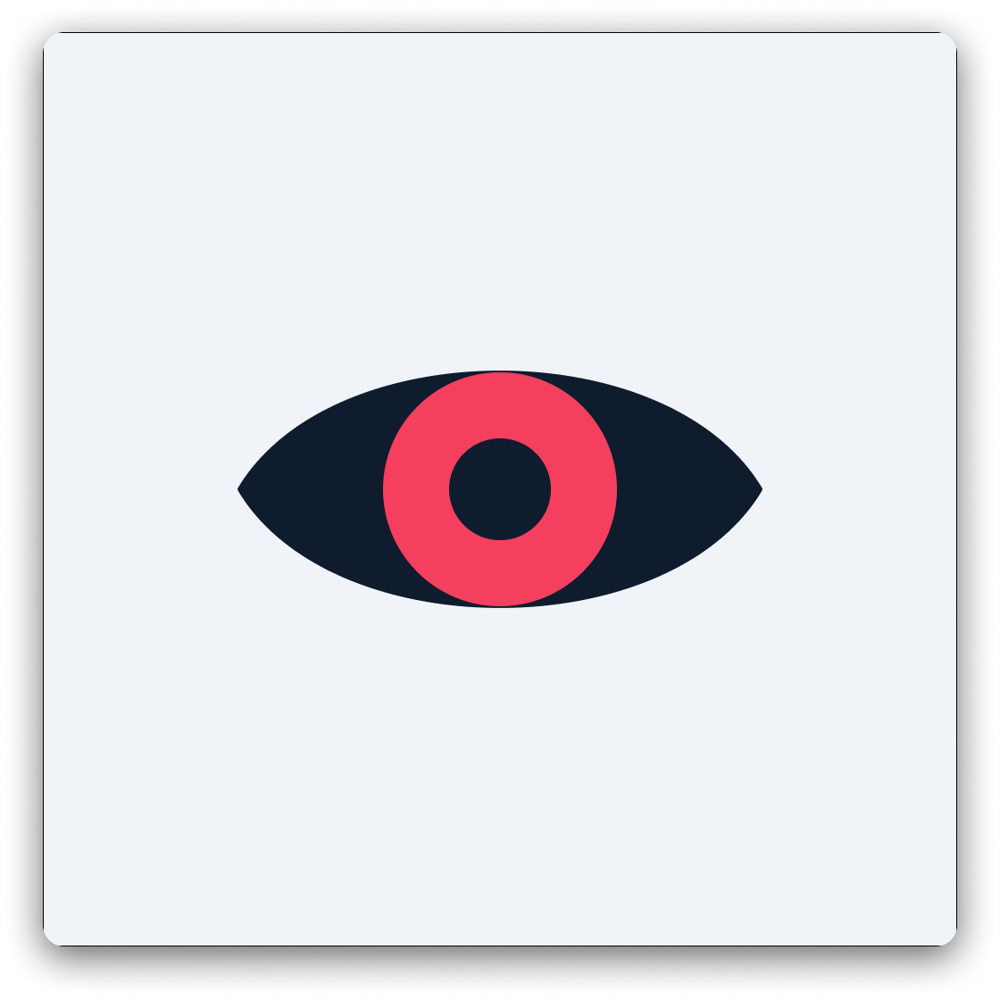

# SITE — AI-Assisted Remote Catheter Monitoring

\
**System for Intelligent Telemonitoring and Early-Detection**
The project of SITE was part of a course at my university called "Product Builder". The main objective ofthe course was to develop a digital health product, moving from problem validation to a functional prototype fitting the identified need and a viable business case. Throughout the course, we followed a structured version of the path taken by real founding teams, making decisions under regulatory constraints and limited evidence. The goal was not simply to build a prototype, but to understand what it takes to create solutions that can be meaningfully used, approved, and adopted in real-world healthcare settings. It is important to note that this is not working medical poduct.

---
## Getting Started
### Prerequisites

- Flutter 3.44+ / Dart 3.3+
- A [Firebase](https://console.firebase.google.com) project (Firestore, Auth, and Storage enabled)
- A [Gemini API key](https://aistudio.google.com/apikey)

### Setup

1. **Clone the repo**
   ```bash
   git clone https://github.com/HenriAldo/SITE.git
   cd SITE
   ```

2. **Install dependencies**
   ```bash
   flutter pub get
   ```

3. **Point the app at your own Firebase project**

   `lib/firebase_options.dart` is committed and configured for this project's own Firebase backend — its Firestore rules only grant access to accounts already provisioned there, so a fresh clone can't read or write against it. Run [FlutterFire CLI](https://firebase.google.com/docs/flutter/setup) against your own project to regenerate it:
   ```bash
   dart pub global activate flutterfire_cli
   flutterfire configure
   ```
   Then deploy the included security rules:
   ```bash
   firebase deploy --only firestore:rules,storage
   ```

4. **Add your Gemini API key**
   ```bash
   cp lib/secrets.dart.example lib/secrets.dart
   ```
   Edit `lib/secrets.dart` and replace the placeholder with your real key.

5. **Run the app**
   ```bash
   flutter run
   ```
---
## The Problem

Oncology patients carrying a PICC or tunneled central venous catheter (CVC) at home have no structured way to monitor their catheter exit site between clinical visits. Without guidance, patients either dismiss early warning signs (leading to delayed bacteremia) or panic over benign changes (leading to unnecessary ED visits). Clinicians rely on unreliable verbal phone triage to assess severity remotely.

## The Solution

SITE gives patients a structured daily monitoring routine and replaces phone triage with asynchronous, image-based clinician review.

```
Patient App          →    Gemini Vision API      →    Risk Classification
─────────────────         ──────────────────          ───────────────────
Guided photo capture      CLISA scoring (0–3)         Low      → Reassure
Symptom questionnaire     Clinical context             Moderate → Clinician dashboard
Clinical profile          Symptom integration          High     → Urgent alert
```

## Demo

<table border="0" cellspacing="0" cellpadding="0" style="border:none;border-collapse:collapse;">
  <tr>
    <td align="center" style="border:none;"><b>Patient check-in flow</b><br></td>
    <td align="center" style="border:none;"><b>Assessment and result</b><br></td>
    <td align="center" style="border:none;"><b>Clinician dashboard review</b><br></td>
  </tr>
</table>

---

## AI Assessment

The AI layer uses Gemini's vision model with a structured prompt encoding the **CLISA (Central Line Insertion Site Assessment)** scoring rubric:

| Score | Finding | Action |
|---|---|---|
| 0 | Normal — flesh-colored, no redness or drainage | Continue monitoring |
| 1 | Minimal redness < 3mm, scant non-cloudy drainage | Monitor carefully |
| 2 | Advancing redness 3–6mm or increase over 24h | Alert physician |
| 3 | Purulence, cloudy drainage, or redness > 6mm | Consider line removal |
| NV | Insertion site not visible | Replace dressing |

The model integrates image findings with patient-reported symptoms and clinical context (catheter type, days since insertion, immunosuppression status, diagnosis) to produce a structured JSON risk assessment. A clinician can review and, if needed, override the AI's classification — the app tracks and displays both.

---

## Features

**Patient app**
- Guided photo capture with step-by-step framing instructions
- Daily symptom questionnaire (fever, pain, swelling, drainage, chills, redness, plus free-text extras) with optional voice-to-text on web
- AI risk assessment against the CLISA rubric, integrating symptoms and clinical context
- Assessment history with clinician-reviewed status and reclassification
- 14-day check-in streak grid, tap-through to any day's detail
- In-app notifications when a clinician reviews a check-in, synced across devices via Firestore
- Care team contact card, with a direct-dial link and a 116117 (Germany patient service) fallback
- FAQ / "what counts as a symptom" guidance

**Clinician dashboard**
- Flagged cases in a risk-grouped, master-detail view with quick-classify and one-tap confirm
- Full patient roster — search by name/email, filter to your own patients, assign unassigned ones
- Per-patient detail page: profile, catheter/diagnosis context, check-in streak, recent assessments
- Case detail screen with AI reasoning, visual findings, symptom breakdown, and reasoning-quality feedback
- Clinician profile with contact details (phone/clinic) shown to assigned patients
- Responsive layout — full-width grids on desktop/web, split-pane once something's selected


### Getting clinician access

There's no in-app way to become a clinician — accounts are provisioned by role manually, on purpose (a patient should never be able to self-promote). After registering an account, open the **Authentication → Firestore** console for your project, find that user's document under `users/{uid}`, and add a field: `role: "clinician"` (string). Signing back in routes to the clinician dashboard instead of the patient app.
